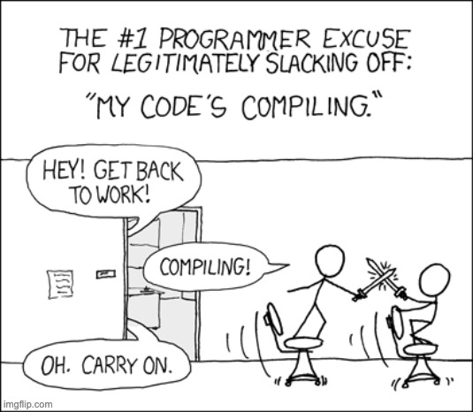

# **Introduction to Bazel**

**{ Fast, Correct } — Choose two**

https://bazel.build/

Rikito Taniguchi

---

# Agenda

- Reminder of the "problem"
- Bazel Concept
- Bazel and Scala tutorial

---



# **Reminder of the Problem**

## ・Building large applicaton is slow

## ・Building slowly is expensive

<!--
Let me start the presentation with the reminder what is the problem.
Of course, the problem we want to solve is: slow compilation,
As you already noticed, Scala compilation is pretty slow, and
once you submit a PR, you have to wait for like 30min to finish the CI
before merging, and if the CI didn't pass, you'll fix the build and re-submit a commit, and wait for another 30 min.
This slow compilation prevent you to be in a flow, and it's a huge burdon for
the project's productivity.
-->

---

# Options to alleviate the problem

- Optimize Scala compilation (maybe using [scalac-profiling](https://www.scala-lang.org/blog/2018/06/04/scalac-profiling.html))
- Optimize sbt build
  - [-Dsbt.traces=true](https://github.com/sbt/sbt/pull/4576)
  - [Custom configuration](https://www.scala-sbt.org/1.x/docs/Advanced-Configurations-Example.html)
- Split to multi-repo
- [Compile Scala Faster with Hydra - Triplequote](https://triplequote.com/hydra)


**Still, build time increase as project grows**

<!--
Even though Scala compilation is slow,
There're several options to improve the build time (except stop using Scala)
One is like profiling the Scala compilation and micro optimize the compilation process.

Or you can improve the build setting in build.sbt
Actually I see narita is doing that by introducing another scope called `it`, which improve the build concurrency.

However still, build time grows if the project source files grow.
This is inevitable even if we use other programming languages.

The proglem is: the traditional build systems (like maven, sbt, and make) is not "scalable".
-->

---


# **Bazel for rescue!**

Build system developed by Google

- Artifact based build system
  - :left_right_arrow: Task based build system (make, ant, sbt...)
- {Fast, Correct} Choose two
  - :arrow_right: Scalable even in Google scale

<!--
To solve the scalability problem, Google build a build system called Bazel

TODO...
-->


---

# {Task, Artifact}-based build system
- **Task based build system**
  - **Imperative** set of tasks (imagine Makefile).
  - You can do pretty much anything.
- **Artifact based build system**
  - **Declative** set of artifacts to build, deps, and limited options
  - Only build, test, and run.

[Software Engineering at Google | chapter 18](https://abseil.io/resources/swe-book/html/ch18.html)

<!--
build file describes a declative set of ...
limited options affect s how they're built
-->

---

# {Fast, Correct} choose two ✌️
**[Hermeticity](https://bazel.build/basics/hermeticity)**
> When given the same input source code and product configuration, a hermetic build system always returns the same output by isolating the build from changes to the host system.

:arrow_right: **Correct** :arrow_right: reliable remote build cache :arrow_right: **Fast**

<!--
The idea of Bazel is we’re gonna actually build things correctly. Your build is a pure function. There’s sources that come in, and then the artifacts go out. And if the sources are the same, the artifacts that pop out the other side will be bit-for-bit identical.
> 
> And so the pitch of Bazel is that we will be fast by being correct. At Google scale, they can’t afford not to cache. And the only way caching is safe, is if it’s correct. So the idea is speed-through-correctness. Whereas a lot of people viewed them in tension with one another.
> 
> Every programmer has the experience of saying, ‘oh the build, broke! Let’s just clean it.’ It’s like the reboot of like builds. It’s awful. Why should you have to reboot your build?
> 
> So with Bazel, you don’t have to do that. You really can build without cleaning. That’s amazing. I mean, it’s sad that that’s the bar, but it’s real, and so Bazel really delivers on that.

I believe you have experience sbt just stopped working and have to run `sbt clean`

-->

---

# Dark side of Bazel

- Poor IDE support (it's getting better though...)
- More build settings
- Explicit dependency management
- Less flexibility

<!--

Bazel is not a silver bullet
there's a significant trade-off


-->

---

# Is Bazel a right path?

Not sure, yet! Bazel is not the only option 

- Split to multi-repo
- Stick with sbt and micro-optimize build
- [Compile Scala Faster with Hydra - Triplequote](https://triplequote.com/hydra)
- **Or, Scale with Bazel**

[When to use Bazel? - Earthly Blog](https://earthly.dev/blog/bazel-build/)

<!--
- There's only 173k lines of Scala code / Mixed Scala and JavaScript
- Compilation time is growning, monorepo, repo will grow?

The goal is not a migrating to Bazel
Migrating Bazel is not a goal,
-->


---


# All team members MUST learn Bazel

More build configurations (than sbt)
:arrow_right: everyone have more opportunity to write build settings
:arrow_right: All developers MUST learn Bazel!

Otherwise... 

> New team mebers didn't learn Bazel ... most of the members could not write Bazel-related code and they just use what there is.

(Japanese blog) [Say goodbye to Bazel and start using make](https://mixi-developers.mixi.co.jp/byebye-bazel-welcome-make-b966bfd37fce)


<!--
Some people may think that writing build settings should be left to those who are familiar with bazel and not to themselves.

Here's the case study by Japanese largest social game developer
introduced Bazel and couldn't fit with Bazel way
-->

---

Questions so far?

---


# **Bazel Tutorial for Scala**

**What you'll learn**

- The essential building blocks of Bazel
  - What the Bazel project looks like
  - What inside `WORKSPACE` and `BUILD` files
  - What is `Label` in Bazel
- How to build jar from Scala fiels using `rules_scala`

[tanishiking/bazel-tutorial-scala](https://github.com/tanishiking/bazel-tutorial-scala)

---


# Install Bazel

Use Bazelisk! It checks `.bazelversion` and download Bazel executable.

[bazelbuild/bazelisk: A user-friendly launcher for Bazel.](https://github.com/bazelbuild/bazelisk)

> Install it as the bazel binary in your PATH (e.g. copy it to /usr/local/bin/bazel). Never worry about upgrading Bazel to the latest version again

```
alias bazel="bazelisk" # I personally do
```

---

[bazel-tutorial-scala/01_scala_tutorial](https://github.com/tanishiking/bazel-tutorial-scala/tree/main/01_scala_tutorial)

```
|-- WORKSPACE
`-- src
    `-- main
        `-- scala
            |-- cmd
            |   |-- BUILD
            |   `-- Runner.scala
            `-- lib
                |-- BUILD
                `-- Greeting.scala
```

- `WORKSPACE` file is about getting stuff from the outside world into your Bazel project. Located at the project root.
- `BUILD` files are about what happening inside of your Bazel project

---

## [Terminology](https://bazel.build/concepts/build-ref)

```
|-- WORKSPACE                                   \
`-- src                                         |
    `-- main                                    |
        `-- scala                               |> workspace
            |-- cmd                \            |    a.k.a.
            |   |-- BUILD          |> package   |  repository
            |   `-- Runner.scala   /            |
            `-- lib                \            |
                |-- BUILD          |> package   |
                `-- Greeting.scala /            /
```
- The whole directory to build with Bazel is called `workspace`
- A `package` is a collection of related files and a `BUILD` file

---

# Understand `WORKSPACE`

```
load("@bazel_tools//tools/build_defs/repo:http.bzl", "http_archive")
# ...
http_archive(
    name = "io_bazel_rules_scala",
    sha256 = "77a3b9308a8780fff3f10cdbbe36d55164b85a48123033f5e970fdae262e8eb2",
    strip_prefix = "rules_scala-20220201",
    type = "zip",
    url = "https://github.com/bazelbuild/rules_scala/releases/download/20220201/rules_scala-20220201.zip",
)
```

https://github.com/tanishiking/bazel-tutorial-scala/blob/main/01_scala_tutorial/WORKSPACE

Basically, just copy and pasted from [bazelbuild/rules_scala](https://github.com/bazelbuild/rules_scala)

<!--
The first thing we should take a look in Bazel workspace is a `WORKSPACE` file
As I mentioned, the `WORKSPACE` file contains the external dependencies
In this example, we download a rules_scala which is a Bazel build rule for Scala.
And also we can see, some settings like Scala version
but basically this is just copy and pasted from `rules_scala`'s instruction
-->

---

# Scala files

```scala
// cat src/main/scala/lib/Greeting.scala
package lib
object Greeting { def sayHi = println("Hi!") }
```

```scala
// cat src/main/scala/cmd/Runner.scala
package cmd
import lib.Greeting
object Runner { def main(args: Array[String]) = { Greeting.sayHi } }
```

- `lib/Greeting.scala` is a library moduel that provides `lib.Greeting`.
- `cmd/Runner.scala` depends on `lib.Greeting`.

<!--
In this project, we build simple CLI application
that print `Hi` to console
2 components `lib`, `cmd`
- lib provides an API `Greeting.sayHi` that prints `Hi!` to console
- and cmd.Runner calls the API from lib.greeting.sayHi

it's simple
so let's build this application using Bazel
-->

---

# Understand `BUILD` file for `lib`

```
# cat src/main/scala/lib/BUILD
load("@io_bazel_rules_scala//scala:scala.bzl", "scala_library")

scala_library(
    name = "greeting",
    srcs = ["Greeting.scala"],
)
```

- `scala_library` is called `rule` in Bazel that describes what to build
- An instance of `rule` is called `target`.

[document: rules_scala/scala_library.md](https://github.com/bazelbuild/rules_scala/blob/master/docs/scala_library.md)

<!--
Ok let's build lib with Bazel

`src/main/scala/lib/BUILD` looks like this, take a look one by one
In the topline, we import `scala_library` from `rules_scala`
`scala_library` is something called build `rule` in Bazel, and we describe
what to build using these build rules.

Next, we define an instance of build rule, and it's called target.
So the `scala_library` function is a rule, and it's instance is `target`.

`scala_library` is a build rule to build a library jar file for Scala
The required attributes are `name` and `srcs`

- name attribute defines the name of the target.
- srcs attribute defines, which scala sources to build

the full documentation is available here
-->

---

# Let's build!

`bazel build <targets>`

```sh
❯ bazel build //src/main/scala/lib:greeting
...
Target //src/main/scala/lib:greeting up-to-date:
  bazel-bin/src/main/scala/lib/greeting.jar
```

Wait, what `//src/main/scala/lib:greeting` means!?

<!--
Ok, now we put `BUILD` file, so it's ready to build the greeting library
To build with Bazel, we type `bazel build` and specify the target to build in arguments

To build the greeting library, we type `bazel build` ... and specify the target, and it produces `greeting.jar` file

(I think everyone don't understand what this `//src/main/scala...` part), but I'll 

-->

---

# Label

Label uniquely identifies a `target`. Canonical form of label looks like

**<span style="color:red">@myrepo//</span><span style="color:blue">my/app/main</span><span style="color:maroon">:app_binary</span>**

- **<span style="color:red">@myrepo//</span>** - repository name defined in `WORKSPACE`, we can omit `@myrepo` and `//` to refer same repository.
- **<span style="color:blue">my/app/main</span>** - path to the package relative to repository root.
- **<span style="color:maroon">:app_binary</span>** - target name

[Labels  |  Bazel](https://bazel.build/concepts/labels)

---

# Label

```sh
❯ bazel build //src/main/scala/lib:greeting
...
Target //src/main/scala/lib:greeting up-to-date:
  bazel-bin/src/main/scala/lib/greeting.jar
```

**<span style="color:red">//</span><span style="color:blue">src/main/scala/lib</span><span style="color:maroon">:greeting</span>**

- **<span style="color:red">//</span>** - (abbreviated) repo name
- **<span style="color:blue">src/main/scala/lib</span>** - path to `BUILD` file (from workspace root)
- **<span style="color:maroon">:greeting</span>** - target name to build

---

# Depends on `lib` target!

```
# cat src/main/scala/cmd/BUILD
load("@io_bazel_rules_scala//scala:scala.bzl", "scala_binary")
scala_binary(
    name = "runner", main_class = "cmd.Runner",
    srcs = ["Runner.scala"],
    deps = ["//src/main/scala/lib:greeting"],
)
```

[scala_binary](https://github.com/bazelbuild/rules_scala/blob/master/docs/scala_binary.md) rule generate a jar file, and shell script to run the jar

Enumerate all dependent targets in `deps` attr

[Dependencies  |  Bazel](https://bazel.build/concepts/dependencies)

---

# Build the binary!

Oops build failed

```
❯ bazel build //src/main/scala/cmd:runner

ERROR: .../01_scala_tutorial/src/main/scala/cmd/BUILD:3:13:
in scala_binary rule //src/main/scala/cmd:runner:
target '//src/main/scala/lib:greeting' is not visible from
target '//src/main/scala/cmd:runner'.
```

By default, all targetss' visibility is `private`, targets in the same packages can access them.


---

# Make `lib` visible from `cmd` package

```diff
 scala_library(
     name = "greeting",
     srcs = ["Greeting.scala"],
+    visibility = ["//src/main/scala/cmd:__pkg__"],
 )
```

[visibility](https://bazel.build/concepts/visibility) controll access grants to packages 

- `//src/main/scala/cmd:__pkg__"`grants access to the package `//src/main/scala/cmd`
- `"//visibility:public"` grants access to all packages 

---

# Build the binary! (again)

```sh
❯ bazel build //src/main/scala/cmd:runner
...
INFO: Found 1 target...
Target //src/main/scala/cmd:runner up-to-date:
  bazel-bin/src/main/scala/cmd/runner.jar
  bazel-bin/src/main/scala/cmd/runner
```

```sh
❯ ./bazel-bin/src/main/scala/cmd/runner
Hi!
```

---

# Tips: Wildcard

Usually build all targets by `$ bazel build //...`

- `//...`	All targets in packages in the workspace. 
- `//foo/...` All rule targets in all packages beneath the directory foo

[Building multiple targets](https://bazel.build/run/build#specifying-build-targets)

---
# Tips: bazel query

[bazel query](https://bazel.build/query/quickstart) is useful to find target

```
❯ bazel query //... | grep lib
//src/main/scala/lib:greeting
```

- `bazel query //...` to list all targets in the repo
- `bazel query //... --output=location` to show the location of target definitions
- `bazel query "rdeps(//..., //src/main/scala/lib:greeting)"`
  - reverse deps of `:greeting` from `//...`

---


# **Tutorial for `rules_jvm_external`**

**What you'll learn**
- How to download external dependencies from maven repositories.
- How to depend on downloaded packages

https://github.com/tanishiking/bazel-tutorial-scala/blob/main/02_scala_maven

---

# rules_jvm_external
[bazelbuild/rules_jvm_external](https://github.com/bazelbuild/rules_jvm_external) is a popular ruleset to resolve and download JVM dependencies.

Download `rules_jvm_external` in `WORKSPACE` as always

```
RULES_JVM_EXTERNAL_TAG = "2.5"
RULES_JVM_EXTERNAL_SHA = "249e8129914be6d987ca57754516be35a14ea866c616041ff0cd32ea94d2f3a1"
http_archive(
    name = "rules_jvm_external",
    sha256 = RULES_JVM_EXTERNAL_SHA,
    strip_prefix = "rules_jvm_external-%s" % RULES_JVM_EXTERNAL_TAG,
    url = "https://github.com/bazelbuild/rules_jvm_external/archive/%s.zip" % RULES_JVM_EXTERNAL_TAG,
)
```

---

# Download JVM deps

```
# WORKSPACE
load("@rules_jvm_external//:defs.bzl", "maven_install")
maven_install(
    artifacts = [
        "org.scalameta:scalameta_2.13:4.5.13",
        "com.lihaoyi:pprint_2.13:0.7.3",
    ],
    repositories = [
        "https://repo1.maven.org/maven2",
    ],
)
```

---

# Use downloaded libraries

```
# cat src/main/scala/example/BUILD
scala_binary(
# ...
    deps = [
        "@maven//:com_lihaoyi_pprint_2_13",
        "@maven//:org_scalameta_scalameta_2_13",
    ],
)
```

> The default label syntax for an artifact `foo.bar:baz-qux:1.2.3` is `@maven//:foo_bar_baz_qux`
https://github.com/bazelbuild/rules_jvm_external#usage

---

# Build it!

```sh
❯ bazel build //src/main/scala/example:app
Target //src/main/scala/example:app up-to-date:
  bazel-bin/src/main/scala/example/app.jar
  bazel-bin/src/main/scala/example/app

❯ bazel-bin/src/main/scala/example/app "object main { println(1) }"
Source(
  stats = List(
    Defn.Object(
      ...
```

---


# Tips: find library's label

[bazel query](https://bazel.build/query/quickstart) again!

Enumerate all targets under `@maven` repo, and grep `pprint`

```sh
❯ bazel query @maven//... | grep pprint
@maven//:com_lihaoyi_pprint_2_13
@maven//:com_lihaoyi_pprint_2_13_0_7_3
```

---

Now you learnt all Bazel basics :tada:

---

# Wanna learn more?
- [Bazel getting started](https://bazel.build/start)
  - Recommend to skim through **Java tutorial** and **Build concepts**
- [bazelbuild/rules_scala](https://github.com/bazelbuild/rules_scala)
- [bazelbuild/rules_jvm_external](https://github.com/bazelbuild/rules_jvm_external)
- [tanishiking/bazel-playground](https://github.com/tanishiking/bazel-playground)
  - You can find my Bazel example projects :smile:
- [Software Engineering at Google, chapter 18](https://abseil.io/resources/swe-book/html/ch18.html)
  - To learn the philosophy of Bazel

---

# Topics I didn't cover

- Target granularity and trade-offs
  - read [How to choose the right build unit granularity | by Natan Silnitsky | Wix Engineering | Medium](https://medium.com/wix-engineering/migrating-to-bazel-from-maven-or-gradle-part-1-how-to-choose-the-right-build-unit-granularity-a58a8142c549)
- Bazel devtools (attached some links in the following slide)
- [Remote Caching](https://bazel.build/remote/caching)
- [Remote Execution](https://bazel.build/remote/rbe)

---

# Interesting Bazel talks and articles
- [Awesome Bazel | awesome-bazel](https://awesomebazel.com/)
- [How to successfully migrate to Bazel from Maven or Gradle. (Natan Silnitsky, Israel - Youtube](https://www.youtube.com/watch?v=2UOFm-Cc_cU&t=2882s])
- [When to use Bazel? - Earthly Blog](https://earthly.dev/blog/bazel-build/)
- [How to choose the right build unit granularity | Medium](https://medium.com/wix-engineering/migrating-to-bazel-from-maven-or-gradle-part-1-how-to-choose-the-right-build-unit-granularity-a58a8142c549)
- [A Bable in Bazel](https://sluongng.hashnode.dev/) Blog posts about Bazel internal

---

**Bazel dev tools**

- [IntelliJ with Bazel](https://ij.bazel.build/)
  - Bazel IDE for IntelliJ, developed by Jetbrains + Bazel team
- [Bazel - Visual Studio Marketplace](https://marketplace.visualstudio.com/items?itemName=BazelBuild.vscode-bazel)
  - Syntax highlight + format + lint
- [bazel-stack-vscode - Visual Studio Marketplace](https://marketplace.visualstudio.com/items?itemName=StackBuild.bazel-stack-vscode)
  - Experimental IDE for VSCode
- [JetBrains/bazel-bsp](https://github.com/JetBrains/bazel-bsp) required for Scala IDE work with Bazel
- [buildtools/buildifier](https://github.com/bazelbuild/buildtools/tree/master/buildifier) Bazel formatter and linter
- [Gazelle](https://github.com/bazelbuild/bazel-gazelle) Bazel build file generator, Scala is not yet supported

---


[Home - BazelCon 2022](https://opensourcelive.withgoogle.com/events/bazelcon2022?utm_source=BazelCon&utm_medium=Social&utm_campaign=BazelCon%2B2022)
